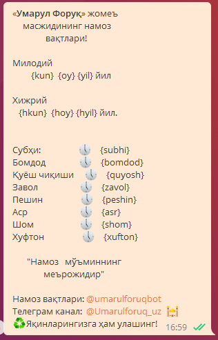
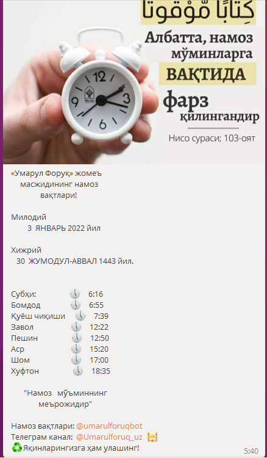
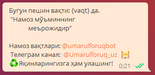
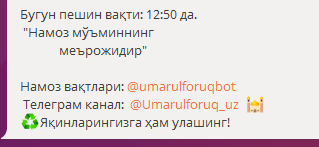
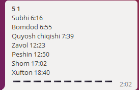

## Namoz vaqtlari bot
Ushbu bot namoz vaqtlarini belgilangan vaqtda ya'ni namoz vaqtidan ozgina oldinroq 
eslatma sifatida foydalanuvchilarga jo'natib turadi.
Telegram qoidalari sababli Bot ko'p foydalanuvchilarga bir vaqtning o'zida xabar
yubora olmaydi ya'ni siz xabar yuborish vaqtini bot foydalanuvchilari
2K dan oshgandan keyin 10 daqida oraliqni mo'ljallab xabar
vaqtni belgilashuingiz kerak bo'ladi.

[Ishlab turgan bot.](https://t.me/umarulforuqbot)
## O'zgaruvchilar

- **Bot malumotlari**

> Bot tokeni va nomi

    src/main/resources/application.yaml

Quyidagi o'zgarishlar

    bot:  
	  name: #BOT NOMI  
	  token: #BOT TOKENI  

**#BOT NOMI** ni siz yaratgan bot nomiga o'zgartirasiz.
**#BOT TOKENI** ga esa sizni botingiz tokeniga o'zgartirasiz.

**Malumotlar bazasiga ulanish**
Bu dasturda malumotlar bazasi sizfatida PostgresSQL olingan. Sizga qanday malumotlar bazasi maq`ul kelsa shunga moslab olishingiz mumkin.
**Postgres** ga ulanishni quyidagicha sozlashingiz mumkin.

    src/main/resources/application.proporties
O'zgaruvchilar

    spring.datasource.url=jdbc:postgresql://localhost:5432/db_nomi  
	spring.datasource.username=username  
	spring.datasource.password=password

**localhost** malumotlar bazasi manzili.
**5432** malumotlar bazasi porti.
**db_nomi** bot uchun belgilangan malumotlar bazasi nomi.
**username** foydalanuvchi nomi "ползивател".
**password** parolingiz.

## Bot ishga tushgandan keyingi sozlamalar.
Avvalo malumotlar bazangizga ulanib `bot_amins` ga bot admini telegram id sini qo'shib qo'yishingiz kerak bo'ladi. Botda bir nechta admin bo'lishi mumkin.

Postgres da `bot_configs` table dagi `config` column ni `Text`
turdagi o'zgaruvchiga almashtirish kerak bo'ladi.
 1. Bot salomlashishini o'zgartirish.

       
    
    Tugmasi orqali o'zgartiriladi. Bunda yuboriladigan xabar ko'rinishi:  Ixtiyoriy salomlashuv va foydalanuvchi ismini qo'shish uchun `{ism}` qo'shimchasidan foydalanasiz. 
    Eslatma foydalanuvchi ismini qo'shi uchun `ism` buyrug'i figurali qavs `{}` ichida yani `{ism}` holatida qo'shilishi kerak! 
    1. Xabarlarni yuborish uchun xabar ko'rinishini belgilash.
           
        
       Shunda siz quyidagi xabarni olasiz
 
       `Xabar yuborish tekstalrini o'zgartirish`
    
       `Ertalabki xabar ko'rinishini kiriting masalan:`
     
       `Assalomu alaykum bugungi kuningiz barokotli o'tsin!`
     
       `Bugungi {kun}.{oy}.{yil} uchun namoz vatlari`
     
       `Subhi {subhi}`
     
       `Bomdod {bomdod}`
     
       `Quyosh chiqishi {quyosh}`
    
       `Zavol {zavol}`
 
       `Peshin {peshin}`
 
       `Asr {asr}`
 
       `Shom {shom}`
 
       `Xufton {xufton}`
    
    Bu holatda siz ertalabki birinchi xabar ko'rinishini kiritasiz buyerdagi kiritishingiz kerak bo'lgan buyruqlar.
        
    1. `{kun}` milodiy yil oyninh kuni raqamlarda aks etadi.
    2. `{oy}` milodiy yilning oyi so'zlarda aks etadi.
    3. `{yil}` milodiy yil raqamlarda aks etadi.
    4. `{hkun}` hijriy yil oyining kuni raqamlarda aks etadi.
    5. `{hoy}` hijriy yil oyi so'zlarda aks etadi.
    6. `{hyil}` hijriy yi raqamlarda aks etadi.
    7. `{subhi}` subhi vaqti aks etadi.
    8. `{bomdod}` bomdod vaqti aks etadi.
    9. `{quyosh}` quyosh chiqish vaqti aks etadi.
    10. `{zavol}` zavol vaqti aks etadi.
    11. `{peshin}` peshin vaqti aks etadi.
    12. `{asr}` asr vaqti aks etadi.
    13. `{shom}` shom vaqti aks etadi.
    14. `{xufton}` xufton vaqti aks etadi.
    
Shunday buyruqlar bialn ertalabki xabar ko'rinishini to'ldirib botga yuborasiz.
MS:

Ko'rinshidagi yuborgan xabaringiz xabar yuborish uchun rasm belgilaganingizdan so'ng 
ertalabki xabar ko'rinishi quyidagicha ko'rinishga keladi:

Ushbu xabarni yuborgach sizga:

Ko'rinishdagi ya'ni peshin vaqti uchun xabar ko'rinishini kiritishni so'raydi. Bu yerda siz yozgan
xabaringiz ichiga `{vaqt}` buyrug'ini qo'shish orqali siz belgilangan 
vaqtni xabaringiz ishiga qo'shishingiz mumkin. MS:

Xabarini yuborib natijada quyidagicha natija olishingiz mumkin:

Keyingi qadamlar Asr, Shom va Xufton uchun ham huddi shunday amallar bajarasiz va 
barchasi uchun vaqt qoshish buyrug'i `{vaqt}` hisoblanadi.

## Vaqtlar yuborish uchun rasmlar tanlash

Bor har bir vaqt uchu alohida rasm yuboradi yani ertalabki xabar uchun
alohida Peshin uchun va boshqa vaqtlar uchunalohida rasmlar yuboradi
bularni belgilash uchun esa quyidagi tugmani bosishingiz kerak bo'ladi.

> Sintaktik xato uchun uzur!

Natijada ushbu  xabarni olasiz va siz istalgan rasmni
yuborishingiz yoki shunchaki forward(ulashish) orqali yuborishingiz
mumkin. Keyingi vaqtlar uchun ham xuddi shunday amallar bajariladi.

## Vaqtlarin yuborish vaqti

Bot foydalanuvchilarga siz belgilagan vaqtda xabar yuborishni boshlaydi
yani namoz vaqtidan ozgina oldinroq
eslatma sifatida foydalanuvchilarga xabar yuboradi.

Bu sozlamani esa quyidagicha amalga oshiriladi:

 Tugmasi  >  
Xabarni olgach siz ertalabki xabar yuborish vaqtini kiritasiz
vaqt kiritish formati `ss mm` ko'rinishida bo'ladi yani orasida (probel) 
bilan ajratilgan bo'lishi kerak. Vaqt kiritishda nollarda foydalanmaslikni
maslahat beramiz masalan `06 03` emas `6 3` qilib kiritishgiz dasturni 
xatoliklardan holi qiladi. Keyingiz xabar yuborish vaqtlarini ham shunday kiritasiz.

## Namoz vaqtlarini qo'shish
 

Tugmadan so'ng siz 

Ko'rinishdagi xabarni olasiz. Bu holatda siz namoz vaqti qo'shish uchun
sanani kiritishingiz lozim bo'ladi. Kiritish formati
`oo ss` birinchi oy raqami va joy tashlab sanani kirtasiz o'rni almashib qolmasligi
zarur. Keyingi qadamlar namoz vaqtlarini kiritish bo'ladi:

Kabi namoz vaqtlaini kiritish haqidagi xabarlarni 
ketma ket olasiz. Vaqt kiritish formai `ss mm` nollardan foydalanish
mumkin chunki bu xbarni dastur hisoblamaydi yani `String` 
formatidan o'zgartirilmaydi.

## Saqlangan vaqtlarni o'chirish

Botga beixtiyor xato sana va oy kiritib yuborgan bolsangiz

Tugmasi orqari noto'g'ri kiritilgan vaqtlarni o'chirishingiz mumkin

Holatdagi vaqtini o'chirish uchun siz `5 1` xabarini **Namozvaqtini o'chirish**
tugmasini bosgach yuborishingiz kerak bo'ladi. Bu yera `5` kun `1` esa oy ga teng.

## Test
Bot admini botga `Test` xabarini yuborsa bot xabarlar foydalanuvchilarga
xabar qanday yetib borayotganini ko'rsatib beradi.